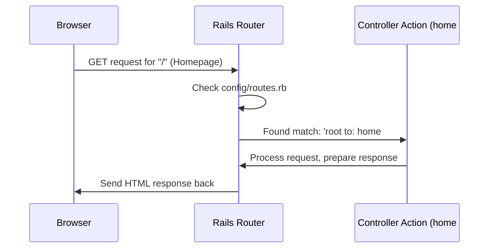

# Chapter 1: Request Routing

Welcome to the `complete-app` tutorial! This is the very first step in understanding how our web application works.

Imagine you want to visit a friend's house. You need their address, right? Once you have the address, you follow the streets and signs to get there. Web applications work similarly. When you type a web address (like `www.ourapp.com/`) into your browser, how does the application know what page or information to show you? That's where **Request Routing** comes in!

**The Problem:** How does our application know what code to run when a user visits a specific URL in their browser?

**The Solution: Request Routing**

Think of Request Routing like the main reception desk or the postal sorting office for our application. When a request arrives (someone visiting a URL), the **Router** looks at the address (the URL path) and decides exactly which part of our application code should handle it.

Let's use our `complete-app` as an example. What happens when you visit the main homepage? How does it show the welcome content? The answer lies in a special file: `config/routes.rb`.

**Our Application's Address Book: `config/routes.rb`**

This file contains the map for our application's web addresses. Let's look at a snippet:

```ruby
# File: config/routes.rb
Rails.application.routes.draw do
  # ... other routes ...

  # This line defines the homepage
  root to: 'home#index'
end
```

*   **`Rails.application.routes.draw do ... end`**: This block is where we define all the possible "addresses" our application understands.
*   **`root to: 'home#index'`**: This is a special instruction. `root` refers to the main page of our website (like `www.yourapp.com/`). `to: 'home#index'` tells Rails: "When someone requests the root URL, send them to the `index` action inside the `home` controller."

Don't worry too much about "controllers" and "actions" just yet. We'll cover them in detail in the next chapter, [Controller Actions](02_controller_actions_.md). For now, just think of `'home#index'` as the specific "office" or "person" responsible for handling the homepage request.

Let's look at another route:

```ruby
# File: config/routes.rb
Rails.application.routes.draw do
  # Route for the "Make Change" feature page
  get 'make_change', to: "make_change#index"

  # ... other routes ...
  root to: 'home#index'
end
```

*   **`get 'make_change', to: "make_change#index"`**: This line sets up another address.
    *   `get`: This specifies the *type* of request. `GET` requests are typically used just for retrieving information (like loading a webpage).
    *   `'make_change'`: This is the URL path. So, if you visit `www.yourapp.com/make_change`, this route will match.
    *   `to: "make_change#index"`: This tells Rails to send requests for `/make_change` to the `index` action within the `make_change` controller.

**How it Works: Step-by-Step**

Let's visualize the journey of a request for the homepage:

1.  **You:** You type `www.yourapp.com/` into your browser and hit Enter.
2.  **Browser:** Sends an HTTP `GET` request to your application's server asking for the `/` path.
3.  **Rails Router:** Receives the request. It opens its map (`config/routes.rb`).
4.  **Router:** Looks for a rule matching a `GET` request for the `/` path. It finds `root to: 'home#index'`.
5.  **Router:** Knows the request needs to be handled by the `home` controller's `index` action.
6.  **Rails:** Passes the request information to the `home#index` [Controller Action](02_controller_actions_.md) to generate the response (the webpage).
7.  **Browser:** Receives the response and displays the homepage.

Here's a simple diagram showing this flow:



**Other Routes**

Our `config/routes.rb` file has a couple more lines:

```ruby
# File: config/routes.rb
Rails.application.routes.draw do
  get 'make_change', to: "make_change#index"

  # Routes related to logging out and handling login callbacks
  get 'logout', to: 'auth#logout'
  get 'auth/:provider/callback', to: 'auth#callback'

  root to: 'home#index'
end
```

*   `get 'logout', to: 'auth#logout'`: Defines the `/logout` URL. Visiting this address will trigger the `logout` action in the `auth` controller, handling the user logout process.
*   `get 'auth/:provider/callback', to: 'auth#callback'`: This route is a bit more complex and is used for handling logins via external services (like FusionAuth, which we'll cover in [OmniAuth OIDC Integration (FusionAuth)](04_omniauth_oidc_integration__fusionauth__.md)). The `:provider` part is a placeholder that can change. This route sends the request to the `callback` action in the `auth` controller.

These authentication routes are linked to concepts we'll explore in [Authentication Enforcement](03_authentication_enforcement_.md) and [OmniAuth OIDC Integration (FusionAuth)](04_omniauth_oidc_integration__fusionauth__.md).

**Under the Hood**

When your Rails application starts, it reads the `config/routes.rb` file and compiles all these rules into an efficient internal map. It uses this map to quickly find the correct controller and action for any incoming request URL and method (`GET`, `POST`, etc.). The syntax (`get`, `root`, `to:`) is a special Ruby syntax called a Domain Specific Language (DSL), designed to make defining routes clear and concise.

**Conclusion**

You've just learned about Request Routing, the fundamental mechanism that connects web addresses (URLs) to the specific parts of our application code that handle them. We saw how the `config/routes.rb` file acts as the central map, using rules like `root` and `get` to direct incoming requests based on the URL path.

Now that we understand how a request gets directed *to* the right place (like `home#index` or `make_change#index`), our next step is to see what actually happens *at* that destination.

Ready to see what the code does once the router points the way? Let's dive into [Controller Actions](02_controller_actions_.md)!

---

Generated by [AI Codebase Knowledge Builder](https://github.com/The-Pocket/Tutorial-Codebase-Knowledge)