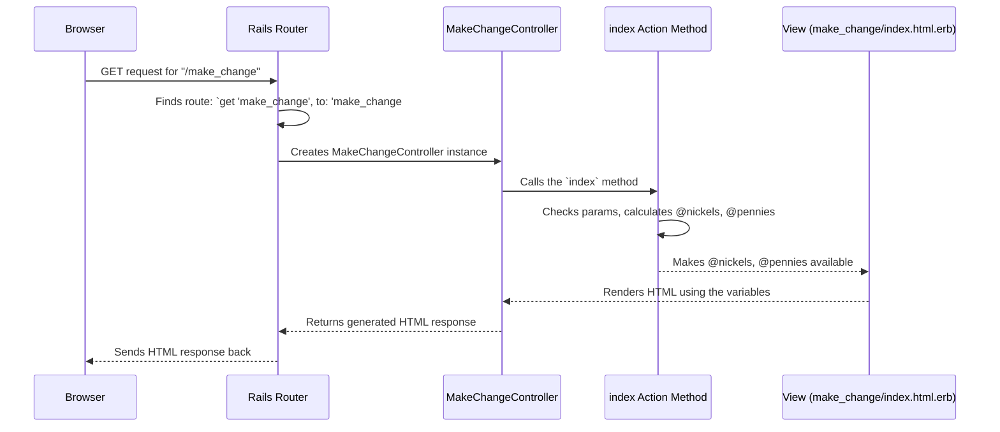

# Chapter 2: Controller Actions

In [Chapter 1: Request Routing](01_request_routing_.md), we saw how our application uses `config/routes.rb` like a map to direct incoming web requests to the right place, like `'home#index'`. But what *is* `'home#index'`, and what happens when the request arrives there? That's where **Controller Actions** come in!

**The Problem:** The router knows *where* to send a request (like the address of a specific office), but what code actually *runs* inside that office to handle the request and decide what the user sees?

**The Solution: Controller Actions**

Think of a controller as a department in our application, responsible for a specific area (like handling the homepage or managing user authentication). Within each controller "department", there are specific tasks or methods called **actions**. These actions are the core workers that respond to web requests.

Let's use the analogy of a restaurant chef:

1.  **Request Arrives (Order Ticket):** The router sends the request details (like visiting the homepage) to the correct controller and action. This is like the waiter giving an order ticket to the chef.
2.  **Controller Action Executes (Chef Cooks):** The specific action method runs. It might fetch data (ingredients), perform calculations or logic (cook the dish), and prepare the necessary information for the user interface (plate the food).
3.  **Response Sent (Dish Served):** The result (usually an HTML web page) is sent back to the user's browser.

**Controllers: The Departments**

In Rails, controllers are Ruby classes that group related actions. They usually live in the `app/controllers/` directory. Their names typically end with `Controller`.

For example, in our `complete-app`, we have:

*   `app/controllers/home_controller.rb`: Handles requests related to the homepage.
*   `app/controllers/make_change_controller.rb`: Handles requests for our "Make Change" feature.
*   `app/controllers/auth_controller.rb`: Handles requests related to login and logout.

**Actions: The Tasks within Departments**

Actions are public methods defined inside a controller class. When our router mapped the root URL (`/`) to `'home#index'`, it meant: "Find the `HomeController` class and run its `index` method."

Let's look at the `HomeController`:

```ruby
# File: app/controllers/home_controller.rb
class HomeController < ApplicationController

  # We'll discuss this 'skip_before_action' in Chapter 3
  skip_before_action :authenticate_user!

  # This is the 'index' action!
  def index
    # This action is very simple.
    # It doesn't need to do any specific work.
    # Rails will automatically look for a view file
    # named 'index.html.erb' in 'app/views/home/'
    # and render it.
  end
end
```

*   **`class HomeController < ApplicationController`**: This line defines our controller class named `HomeController`. It inherits functionality from `ApplicationController`, which we'll explore in [Base Application Controller](05_base_application_controller_.md).
*   **`def index ... end`**: This defines the `index` method. This specific method is the **Controller Action** that runs when someone visits the homepage (`/`) because our route (`root to: 'home#index'`) points here.
*   **Inside `index`**: In this simple case, the method is empty! By default, if an action doesn't explicitly say what to render, Rails will automatically try to find and display a corresponding view file (like `app/views/home/index.html.erb`). We'll touch more on views later, but for now, know the action's job is often to prepare data *for* the view.

**A More Involved Action: Preparing Data**

Let's look at the `MakeChangeController` which does a bit more work:

```ruby
# File: app/controllers/make_change_controller.rb
class MakeChangeController < ApplicationController
  # This is the 'index' action for the make_change feature
  def index
    # Check if an 'amount' was submitted with the request
    if defined? params[:amount]
      # Convert the submitted amount (which comes as text)
      # to a decimal number for calculations.
      amount = params[:amount].to_d

      # Prepare variables for the view:
      # '@' means it's an "instance variable"
      # available in the corresponding view file.

      # Format the amount nicely (e.g., 1.2 becomes "1.20")
      @formatted_amount = sprintf("%0.2f", amount)

      # Calculate the number of nickels
      @nickels = (amount / 0.05).to_i

      # Calculate the remaining pennies
      @pennies = ((amount - 0.05*@nickels) / 0.01).round
    end
    # Again, Rails implicitly renders 'app/views/make_change/index.html.erb'
    # The view can now use @formatted_amount, @nickels, and @pennies.
  end
end
```

*   **`def index ... end`**: This is the `index` action for the `MakeChangeController`. It handles requests to the `/make_change` URL (remember `get 'make_change', to: "make_change#index"` from Chapter 1).
*   **`params[:amount]`**: Actions have access to incoming request data (like form inputs or URL parameters) through a special `params` object. Here, it checks if an `amount` was provided.
*   **Calculations**: If an amount is present, the action performs calculations to figure out the number of nickels and pennies.
*   **`@formatted_amount`, `@nickels`, `@pennies`**: These are **instance variables** (they start with `@`). The key thing about instance variables set in an action is that they are automatically made available to the corresponding view file (`app/views/make_change/index.html.erb` in this case). This is how the action prepares and passes data for presentation.

**How it Works: Under the Hood**

Let's trace the journey for the `/make_change` request:

1.  **Browser:** Sends a `GET` request for `/make_change`.
2.  **Rails Router:** Checks `config/routes.rb`, finds `get 'make_change', to: "make_change#index"`.
3.  **Rails:** Knows it needs the `index` action in `MakeChangeController`.
4.  **Rails:** Creates a *new instance* (a temporary copy) of the `MakeChangeController`.
5.  **Rails:** Calls the `index` method (the action) on that controller instance.
6.  **`index` Action:** Executes its code: checks `params`, calculates `@nickels`, `@pennies`, etc.
7.  **Rails:** (Implicitly) Renders the `app/views/make_change/index.html.erb` view, making the instance variables (`@nickels`, etc.) available to it.
8.  **Rails:** Sends the generated HTML back to the browser.

Here's a diagram showing this flow:



**Controllers and Inheritance**

You might have noticed both `HomeController` and `MakeChangeController` start with:

```ruby
class HomeController < ApplicationController
# and
class MakeChangeController < ApplicationController
```

The `< ApplicationController` part means they *inherit* from `ApplicationController` (defined in `app/controllers/application_controller.rb`). Inheritance is a way to share common code and behavior. Think of `ApplicationController` as the main office manager providing rules and tools that all departments (other controllers) use. We'll dive into what `ApplicationController` does for us in [Base Application Controller](05_base_application_controller_.md) and see how it relates to security in [Authentication Enforcement](03_authentication_enforcement_.md).

**Conclusion**

You've now learned about Controller Actions! They are the heart of request processing in Rails.

*   **Controllers** (like `HomeController`) are classes that group related functionality.
*   **Actions** (like `def index`) are methods within controllers that handle specific requests identified by the router.
*   Actions perform logic, interact with data (if needed), and prepare information (using instance variables like `@my_data`) for the view that gets sent back to the user.

We've seen how the router directs traffic (`home#index`) and what happens when it arrives (the `index` method in `HomeController` runs). But what if we want to restrict *who* can access certain actions? For example, maybe only logged-in users should be able to access the `/make_change` page. How do we enforce that?

Let's find out in the next chapter: [Authentication Enforcement](03_authentication_enforcement_.md)!

---

Generated by [AI Codebase Knowledge Builder](https://github.com/The-Pocket/Tutorial-Codebase-Knowledge)