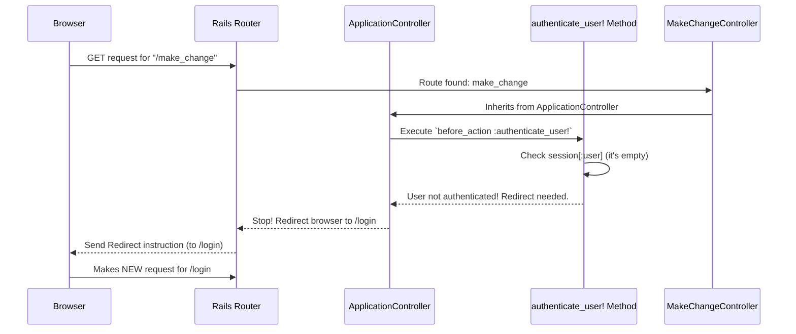

# Chapter 3: Authentication Enforcement

In [Chapter 2: Controller Actions](02_controller_actions_.md), we learned how controller actions like `index` in `MakeChangeController` handle requests and prepare data. We saw that anyone could visit the `/make_change` page. But what if we want to restrict access? What if only logged-in users should be able to use the "Make Change" feature?

**The Problem:** How do we ensure that only users who have successfully logged in can access certain parts of our application? We need a security checkpoint!

**The Solution: Authentication Enforcement via `before_action`**

Imagine your favorite club has a VIP section. Before you can enter, a security guard checks if you have a VIP pass. If you do, you're allowed in. If not, you're politely directed away (maybe to the regular entrance or told you need a pass).

In our web application, **Authentication Enforcement** works like that security guard. It checks if a user is "authenticated" (meaning they've logged in successfully and we recognize them) *before* allowing them to access a restricted controller action (like the `make_change` page).

We implement this using a powerful Rails feature called `before_action` inside our main application controller.

**Key Concept: `before_action` - The Security Checkpoint**

A `before_action` is a special instruction you put in a controller. It names a method that Rails should run *before* it runs the regular controller action (like `index`).

Think of it like this:

1.  User requests `/make_change`.
2.  Rails Router sends the request to `MakeChangeController`'s `index` action ([Chapter 1: Request Routing](01_request_routing_.md)).
3.  **BUT WAIT!** Before running `index`, Rails checks if there are any `before_action` methods listed for this controller.
4.  If there is a `before_action`, Rails runs that method *first*.
5.  The `before_action` method decides:
    *   If the user is okay (logged in), it lets Rails proceed to the original `index` action.
    *   If the user is not okay (not logged in), it can stop the process and redirect the user elsewhere (like the login page).

**Implementing the Check in `ApplicationController`**

Where do we put this security check? Since we want most pages in our application to be protected, we'll put the check in the main `ApplicationController` (located at `app/controllers/application_controller.rb`). Remember from [Chapter 2: Controller Actions](02_controller_actions_.md), other controllers like `MakeChangeController` inherit from `ApplicationController`. This means they automatically get the features and rules defined in `ApplicationController`, including our security check!

Let's look at the relevant part of `ApplicationController`:

```ruby
# File: app/controllers/application_controller.rb
class ApplicationController < ActionController::Base

  # This line sets up the security check for ALL actions
  # in controllers that inherit from ApplicationController.
  before_action :authenticate_user!

  # This is the security check method itself
  def authenticate_user!
    # 'session' is like a temporary storage for this user's browser session.
    # We check if we stored user information (:user) there after login.
    # 'unless session[:user]' means "if session[:user] does NOT exist..."
    redirect_to '/login' unless session[:user]
  end

  # We'll ignore this other before_action for now.
  # before_action :redirect_non_localhost!
  # def redirect_non_localhost! ... end
end
```

*   **`before_action :authenticate_user!`**: This is the instruction. It tells Rails: "Before running *any* action in this controller (or controllers inheriting from it), run the `authenticate_user!` method first."
*   **`def authenticate_user!`**: This is the method that performs the check.
    *   **`session[:user]`**: Think of `session` as a small, temporary storage box tied to the user's browser. When a user logs in successfully (we'll see how in [Chapter 4: OmniAuth OIDC Integration (FusionAuth)](04_omniauth_oidc_integration__fusionauth__.md)), we store some of their information in `session[:user]`.
    *   **`unless session[:user]`**: This checks if the `session` box *doesn't* have any user information stored under the key `:user`. This happens if the user hasn't logged in yet.
    *   **`redirect_to '/login'`**: If there's no user info in the session, this line tells Rails to stop processing the original request and instead send the user's browser to the `/login` URL. This forces them to log in before they can proceed.

**The Result:** Because `MakeChangeController` inherits from `ApplicationController`, this `before_action :authenticate_user!` applies to its `index` action too! If a logged-out user tries to visit `/make_change`, the `authenticate_user!` method runs first, finds no `session[:user]`, and redirects them to `/login`.

**But What About Public Pages? Skipping the Check**

Our security check is now *too* strict! It applies to *every* action. What about the homepage (`/`)? Or the login page (`/login`) itself? Or the logout page (`/logout`)? Users need to be able to access these *without* being logged in!

We need a way to tell specific controllers or actions to *skip* the security check. We do this using `skip_before_action`.

Look at `HomeController`:

```ruby
# File: app/controllers/home_controller.rb
class HomeController < ApplicationController

  # Skip the :authenticate_user! check for actions in THIS controller.
  skip_before_action :authenticate_user!

  def index
    # Now, anyone can access the homepage without being redirected.
  end
end
```

*   **`skip_before_action :authenticate_user!`**: This line specifically tells Rails: "Even though `ApplicationController` set up the `authenticate_user!` check, ignore it for all actions defined within *this* `HomeController`."

Similarly, the `AuthController` (which handles login callbacks and logout) also needs to skip this check, because users aren't logged in yet when the login process starts!

```ruby
# File: app/controllers/auth_controller.rb
class AuthController < ApplicationController

  # Skip the authentication check for login/logout actions.
  skip_before_action :authenticate_user!

  def logout
    # ... logout logic ...
  end

  def callback
    # ... login callback logic ...
  end
end
```

**How it Works: Step-by-Step (Logged-Out User)**

Let's trace what happens when a **logged-out user** tries to access `/make_change`:

1.  **Browser:** Sends `GET` request for `/make_change`.
2.  **Rails Router:** Finds route `get 'make_change', to: 'make_change#index'`.
3.  **Rails:** Sees that `MakeChangeController` inherits from `ApplicationController`.
4.  **Rails:** Checks `ApplicationController` for `before_action`s. Finds `before_action :authenticate_user!`.
5.  **Rails:** Executes the `authenticate_user!` method.
6.  **`authenticate_user!`:** Checks `session[:user]`. Finds it's empty (user is not logged in).
7.  **`authenticate_user!`:** Executes `redirect_to '/login'`.
8.  **Rails:** Stops processing the original request for `/make_change` and sends a redirect instruction to the browser, telling it to go to `/login` instead.
9.  **Browser:** Receives the redirect and makes a *new* request for `/login`. (This new request will likely be handled by `AuthController` or another mechanism defined in your routes/setup, eventually showing the login form).

Here's a diagram:



**How it Works: Step-by-Step (Logged-In User)**

Now, what happens when a **logged-in user** (who *has* `session[:user]` data) visits `/make_change`:

1.  **Browser:** Sends `GET` request for `/make_change`.
2.  **Rails Router:** Finds route `get 'make_change', to: 'make_change#index'`.
3.  **Rails:** Sees `MakeChangeController` inherits from `ApplicationController`.
4.  **Rails:** Checks for `before_action`s. Finds `before_action :authenticate_user!`.
5.  **Rails:** Executes the `authenticate_user!` method.
6.  **`authenticate_user!`:** Checks `session[:user]`. Finds data exists (user is logged in).
7.  **`authenticate_user!`:** The `unless session[:user]` condition is false, so the `redirect_to` is *not* executed. The method finishes.
8.  **Rails:** Since the `before_action` finished without redirecting, Rails proceeds to execute the original target: the `index` action in `MakeChangeController`.
9.  **`MakeChangeController#index`:** Runs its logic (calculates change, etc.).
10. **Rails:** Renders the `make_change/index.html.erb` view and sends the HTML response to the browser.
11. **Browser:** Displays the `/make_change` page.

**Where Does `session[:user]` Come From?**

We briefly mentioned that `session[:user]` gets set when a user logs in. The actual process of logging in, interacting with an external authentication provider (like FusionAuth in our case), and storing that information in the session is handled by the code related to our `AuthController` and a library called OmniAuth. We'll dive deep into that exciting part in the next chapter!

**Conclusion**

You've now learned how we protect parts of our application using **Authentication Enforcement**.

*   We use `before_action` in our `ApplicationController` to run a security check method (`authenticate_user!`) before most actions.
*   This method checks for user data stored in the `session`.
*   If the user isn't logged in (`session[:user]` is missing), they are redirected to the login page.
*   We use `skip_before_action` in controllers like `HomeController` and `AuthController` to allow access to public pages (like the homepage and login/logout actions) without requiring login.
*   This ensures that sensitive features, like `/make_change`, are only accessible to authenticated users.

But how does a user *get* authenticated? How do they log in and have their details stored in the `session`? Let's explore the login process itself in [Chapter 4: OmniAuth OIDC Integration (FusionAuth)](04_omniauth_oidc_integration__fusionauth__.md)!

---

Generated by [AI Codebase Knowledge Builder](https://github.com/The-Pocket/Tutorial-Codebase-Knowledge)