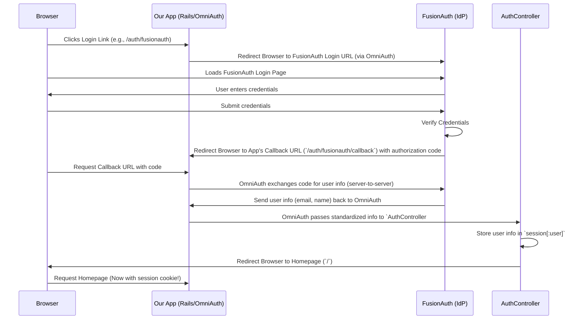

# Chapter 4: OmniAuth OIDC Integration (FusionAuth)

In [Chapter 3: Authentication Enforcement](03_authentication_enforcement_.md), we learned how our app uses `before_action` and `session[:user]` to make sure only logged-in users can access certain pages like `/make_change`. We saw that if `session[:user]` is missing, the user gets redirected to `/login`. But how does a user actually *log in* and get their information stored in `session[:user]` in the first place?

**The Problem:** Building a secure login system (handling usernames, passwords, password resets, security threats) is complex and risky. How can our application let users log in securely without having to manage passwords itself?

**The Solution: Delegating Login to a Trusted Expert using OmniAuth and OIDC**

Instead of building our own login system, we'll delegate this important task to a specialized, external service called an **Identity Provider (IdP)**. In our case, we're using **FusionAuth**. We also need a standard way for our app to talk to FusionAuth. That's where **OpenID Connect (OIDC)** and **OmniAuth** come in.

Let's break down the key players:

1.  **FusionAuth:** Our chosen Identity Provider. It's a separate service that securely stores user accounts and handles the actual login process (checking username/password). Think of it as the central security office for many applications.
2.  **OpenID Connect (OIDC):** A standard communication protocol built on top of another standard called OAuth 2.0. It defines a reliable way for our app to ask FusionAuth "Is this user who they say they are?" and get back basic profile information if the user approves. Think of it as the secure language our app and FusionAuth use to talk about user identity.
3.  **OmniAuth:** A Ruby library (a "gem") that acts as a standard adapter or "middleman" within our Rails application. It simplifies the process of connecting to *any* external authentication provider (like FusionAuth, Google, Facebook, etc.) that speaks common protocols like OIDC. It handles the back-and-forth communication details defined by OIDC.

**The Login Dance: How it Works High-Level**

Imagine you need a security badge to enter a specific building (our app's restricted area). Instead of the building issuing badges itself, it sends you to a central Security Office (FusionAuth).

1.  **You click "Login" in our app:** Our app doesn't show a password form. Instead, it says, "Okay, go to the Security Office (FusionAuth) to get verified."
2.  **Redirect to FusionAuth:** Your browser is sent to FusionAuth's login page.
3.  **You log in at FusionAuth:** You enter your username and password *directly* on FusionAuth's secure site. Our app never sees your password!
4.  **FusionAuth Verifies You:** FusionAuth checks your credentials. If they are correct, it confirms your identity.
5.  **Redirect Back to Our App:** FusionAuth sends your browser back to a special "callback" URL in our application (like `http://localhost:3000/auth/fusionauth/callback`). It includes a temporary, secure "proof" (an authorization code) that you successfully logged in.
6.  **OmniAuth Handles the Callback:** OmniAuth, our middleman, catches this redirect. It takes the proof from FusionAuth.
7.  **OmniAuth Gets User Info:** OmniAuth secretly talks to FusionAuth one more time, exchanging the proof for some basic user details (like email, name - whatever we configured it to ask for).
8.  **Our App Gets the Info:** OmniAuth standardizes this user information and passes it to our application's designated handler - the `callback` action in our `AuthController`.
9.  **Session Set:** Our `AuthController#callback` takes the user info from OmniAuth and stores it in `session[:user]`. Now our app knows you're logged in! ([Chapter 3: Authentication Enforcement](03_authentication_enforcement_.md) relies on this).
10. **Access Granted:** You are redirected to the application's main page (or wherever you were trying to go) as a logged-in user.

**Configuring the Connection: The OmniAuth Initializer**

How does our app know how to talk to FusionAuth? We configure OmniAuth in a special file that runs when the application starts.

```ruby
# File: config/initializers/omniauth.rb

# This line tells Rails to use the OmniAuth middleware.
Rails.application.config.middleware.use OmniAuth::Builder do
  # Configure the OpenID Connect provider strategy
  provider :openid_connect,
    # --- Basic Settings ---
    name: :fusionauth, # A nickname for this provider configuration
    scope: [:openid, :email, :profile], # What info to request (standard OIDC scopes)
    response_type: :code, # Use the secure "Authorization Code Flow"
    issuer: Rails.configuration.x.fusionauth.issuer, # Where to find FusionAuth's config

    # --- Specific FusionAuth Details ---
    client_options: {
      identifier: Rails.configuration.x.fusionauth.client_id, # Our app's ID in FusionAuth
      secret: ENV["OP_SECRET_KEY"], # Our app's secret key (kept secure!)
      redirect_uri: 'http://localhost:3000/auth/fusionauth/callback', # Where FusionAuth sends user back

      # --- OIDC Endpoints (URLs for specific actions) ---
      # Sometimes needed if discovery from 'issuer' doesn't work perfectly
      authorization_endpoint: Rails.configuration.x.fusionauth.issuer+"/oauth2/authorize",
      token_endpoint: Rails.configuration.x.fusionauth.issuer+"/oauth2/token",
      userinfo_endpoint: Rails.configuration.x.fusionauth.issuer+"/oauth2/userinfo",
      # ... other options ...
    }
end
```

*   **`use OmniAuth::Builder do ... end`**: This block activates OmniAuth and lets us define providers.
*   **`provider :openid_connect, ...`**: Tells OmniAuth to use the standard OpenID Connect strategy.
*   **`name: :fusionauth`**: Gives this specific setup a name. This affects the callback URL (`/auth/fusionauth/callback`).
*   **`scope: [...]`**: Specifies what pieces of user information we'd like FusionAuth to give us (if the user consents). `openid` is required for OIDC, `email` and `profile` are common additions.
*   **`issuer:`**: The base URL of our FusionAuth instance. OmniAuth often uses this to automatically discover the other necessary endpoint URLs (like `authorization_endpoint`, `token_endpoint`, etc.) using a standard OIDC discovery process.
*   **`client_options: { ... }`**: Contains details specific to *our application's registration* within FusionAuth.
    *   **`identifier:`**: Our application's unique ID, given to us when we registered our app with FusionAuth.
    *   **`secret:`**: A password for our application, also provided by FusionAuth. **Important:** This is kept secret (often using environment variables like `ENV["OP_SECRET_KEY"]`) and should never be checked into version control directly.
    *   **`redirect_uri:`**: The exact URL within our app that FusionAuth should send the user back to after login. This *must* match what's configured in FusionAuth for our application.
    *   **Endpoint URLs (`authorization_endpoint`, etc.)**: These explicitly tell OmniAuth the specific URLs for starting the login flow, exchanging the code for a token, and getting user info. While often discovered automatically via the `issuer`, specifying them ensures it works even if discovery fails (common in local development setups).

**Where Do `issuer` and `client_id` Come From?**

The `issuer` and `client_id` values used above are specific to our setup. We store them in configuration files that can change depending on the environment (development, production).

```ruby
# File: config/environments/development.rb

Rails.application.configure do
  # ... other development settings ...

  # FusionAuth OIDC configuration for DEVELOPMENT
  config.x.fusionauth.issuer = "http://localhost:9011" # Our local FusionAuth URL
  config.x.fusionauth.client_id = "e9fdb985-9173-4e01-9d73-ac2d60d1dc8e" # Our app's ID

  # ... other development settings ...
end
```

*   **`config.x.fusionauth...`**: This is a custom configuration namespace Rails provides. We store our FusionAuth details here.
*   In a real production environment, the `issuer` would point to the live FusionAuth server URL, and the `client_id` might be different. The `secret` would definitely be loaded securely, not hardcoded.

**Handling the User's Return: The Callback Action**

Remember the `redirect_uri` points to `/auth/fusionauth/callback`. We need a route and a controller action to handle this.

From [Chapter 1: Request Routing](01_request_routing_.md), we have this route:

```ruby
# File: config/routes.rb
get 'auth/:provider/callback', to: 'auth#callback'
```

This route directs requests like `/auth/fusionauth/callback` to the `callback` action in `AuthController`. Let's see that action:

```ruby
# File: app/controllers/auth_controller.rb
class AuthController < ApplicationController
  # Allow access to callback/logout without being logged in
  skip_before_action :authenticate_user!

  # ... (logout action omitted for brevity) ...

  # This action handles the redirect back from FusionAuth
  def callback
    # OmniAuth magically provides standardized user info here!
    auth_hash = request.env['omniauth.auth']

    # Extract the 'info' part (contains name, email, etc.)
    user_info = auth_hash.info

    # Store the user info in the session
    session[:user] = user_info

    # Redirect the now logged-in user to the homepage
    redirect_to '/'
  end
end
```

*   **`skip_before_action :authenticate_user!`**: Crucial! The user isn't technically "logged in" according to *our app's session* until this action finishes, so we must skip the check from [Chapter 3: Authentication Enforcement](03_authentication_enforcement_.md).
*   **`request.env['omniauth.auth']`**: This is where OmniAuth places the user information it received from FusionAuth, neatly packaged in a standardized hash format. This "auth hash" contains details like the provider name, user ID from the provider, and the `info` hash.
*   **`auth_hash.info`**: The `info` key within the auth hash typically contains the user profile details we requested via the `scope` (like email, name).
*   **`session[:user] = user_info`**: This is the critical step! We store the retrieved user information in our application's `session`. Now, the `authenticate_user!` method in `ApplicationController` will recognize the user as logged in on subsequent requests.
*   **`redirect_to '/'`**: After successfully setting the session, we send the user to the application's homepage.

**Visualizing the Flow**

Here's a simplified diagram of the login process:



**Logging Out**

Logging out involves two steps: clearing our application's session and, ideally, telling FusionAuth to end the session there too.

```ruby
# File: app/controllers/auth_controller.rb
class AuthController < ApplicationController
  skip_before_action :authenticate_user!

  def logout
    # 1. Clear our application's session
    session[:user] = nil

    # 2. Redirect to FusionAuth's logout endpoint
    # This ensures the user is logged out of FusionAuth as well.
    # We pass our app's client_id so FusionAuth knows which app initiated logout.
    redirect_to Rails.configuration.x.fusionauth.issuer +
                "/oauth2/logout?client_id=" +
                Rails.configuration.x.fusionauth.client_id
  end

  # ... (callback action omitted for brevity) ...
end
```

*   **`session[:user] = nil`**: Clears the user data from our app's session. The `authenticate_user!` check will now fail.
*   **`redirect_to ... /oauth2/logout ...`**: Sends the user's browser to FusionAuth's standard logout URL. This often clears FusionAuth's own session cookies for that user. Passing the `client_id` helps FusionAuth identify the application initiating the logout.

**Conclusion**

You've now seen how our application handles login without managing passwords directly!

*   We use **FusionAuth** as our external **Identity Provider (IdP)**.
*   We use the **OpenID Connect (OIDC)** standard protocol for communication.
*   **OmniAuth** acts as a crucial middleware in Rails, simplifying the OIDC interactions.
*   The process involves redirecting the user to FusionAuth, letting them log in there, and then handling the callback in our `AuthController` to receive user info via `request.env['omniauth.auth']`.
*   Storing this info in `session[:user]` marks the user as logged in within our app.
*   Configuration in `omniauth.rb` and environment files tells OmniAuth how to connect to FusionAuth.

This approach significantly enhances security and simplifies our application code by leveraging a specialized service for authentication.

Now that we understand routing, controllers, authentication enforcement, and the login mechanism, let's take a closer look at the foundation upon which many of our controllers are built.

Next, we'll explore the role of the [Base Application Controller](05_base_application_controller_.md).

---

Generated by [AI Codebase Knowledge Builder](https://github.com/The-Pocket/Tutorial-Codebase-Knowledge)
