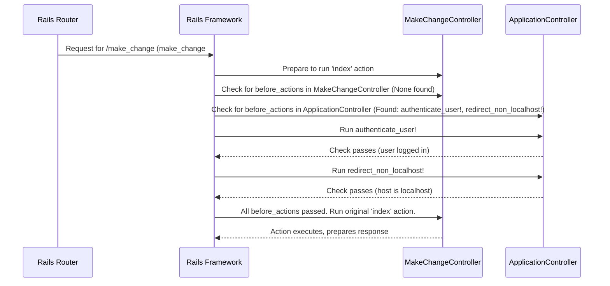

# Chapter 5: Base Application Controller

Welcome back! In [Chapter 4: OmniAuth OIDC Integration (FusionAuth)](04_omniauth_oidc_integration__fusionauth__.md), we saw how users can securely log into our application using an external service like FusionAuth. We also saw in [Chapter 3: Authentication Enforcement](03_authentication_enforcement_.md) that we use a method called `authenticate_user!` to check if a user is logged in before allowing access to certain pages.

But wait, where did `authenticate_user!` actually *live*? We saw it used in `ApplicationController` and skipped in `HomeController` and `AuthController`. How does `MakeChangeController` know about it?

**The Problem:** Imagine our application grows. We might have dozens of controllers (like `ProfileController`, `SettingsController`, `AdminController`). Many of these will need the *exact same* security check (`authenticate_user!`). Do we copy and paste the `before_action :authenticate_user!` line and the `authenticate_user!` method definition into every single controller file? That would be repetitive, hard to update later, and prone to errors! We need a way to **share common functionality** among controllers.

**The Solution: The Base Application Controller (`ApplicationController`)**

Think of building with LEGOs. You often start with a large, flat base plate. You then build different structures (houses, cars, spaceships) on top of this base. The base provides a common foundation.

In Rails, `ApplicationController` (found in `app/controllers/application_controller.rb`) acts like that LEGO base plate for *all* our other controllers. It's the **main parent controller**.

By default, when you create a new controller in Rails (like `HomeController` or `MakeChangeController`), it **inherits** from `ApplicationController`. Inheritance means the new controller automatically gets all the public methods and behaviours defined in its parent.

**Inheritance: Getting Features for Free**

Look at the first line of our `HomeController` from [Chapter 2: Controller Actions](02_controller_actions_.md):

```ruby
# File: app/controllers/home_controller.rb
class HomeController < ApplicationController
  # ... rest of the controller ...
end
```

And the first line of `MakeChangeController`:

```ruby
# File: app/controllers/make_change_controller.rb
class MakeChangeController < ApplicationController
  # ... rest of the controller ...
end
```

The crucial part is `< ApplicationController`. This little symbol `<` signifies inheritance in Ruby. It means: "`HomeController` is a specific *type* of `ApplicationController`" or "`MakeChangeController` is built upon the foundation of `ApplicationController`".

Because they inherit, both `HomeController` and `MakeChangeController` automatically gain access to any features defined in `ApplicationController`.

**Shared Features in `ApplicationController`**

Let's look inside our base controller:

```ruby
# File: app/controllers/application_controller.rb
class ApplicationController < ActionController::Base
  # --- Shared Security Checks ---

  # 1. Ensure user is logged in (runs first)
  before_action :authenticate_user!

  # 2. Ensure the app is accessed via localhost:3000 (runs second)
  before_action :redirect_non_localhost!

  # --- Method Definitions ---

  # The actual login check method
  def authenticate_user!
    # Redirects to login page if user info isn't in the session
    redirect_to '/login' unless session[:user]
    # (As seen in Chapter 3)
  end

  # The actual hostname check method
  def redirect_non_localhost!
    # Redirects if the website address isn't 'localhost'
    # Ensures consistency with FusionAuth's callback URL during development
    redirect_to('http://localhost:3000', allow_other_host: true) unless request.host == "localhost"
  end

  # Other shared methods could go here...
end
```

*   **`class ApplicationController < ActionController::Base`**: Our base controller itself inherits from Rails' own fundamental controller class, `ActionController::Base`, which provides the core features for handling web requests.
*   **`before_action :authenticate_user!`**: This is the key line we saw in [Chapter 3: Authentication Enforcement](03_authentication_enforcement_.md). By placing it here, in the *parent* controller, this check will automatically apply to *all* actions in *any* controller that inherits from `ApplicationController` (like `MakeChangeController`).
*   **`before_action :redirect_non_localhost!`**: This adds another automatic check. The `redirect_non_localhost!` method ensures that during development, we are always accessing the application via `http://localhost:3000`. This is important because our FusionAuth setup in [Chapter 4: OmniAuth OIDC Integration (FusionAuth)](04_omniauth_oidc_integration__fusionauth__.md) expects the callback URL to be exactly `http://localhost:3000/auth/fusionauth/callback`. If we accessed our app via a different address (like `http://127.0.0.1:3000`), the redirect back from FusionAuth might fail. This `before_action` enforces consistency.
*   **Method Definitions (`authenticate_user!`, `redirect_non_localhost!`)**: The actual code for the checks resides here. Because these methods are defined in `ApplicationController`, they are available to be called by the `before_action` directives and are also available within any inheriting controllers (though calling them directly might be less common than using `before_action`).

**How It Works: The Inheritance Chain**

When a request comes in for, say, the `/make_change` page:

1.  **Router:** Maps `/make_change` to `MakeChangeController#index` ([Chapter 1: Request Routing](01_request_routing_.md)).
2.  **Rails:** Prepares to run the `index` action in `MakeChangeController`.
3.  **Rails:** Checks for `before_action`s.
    *   It first looks in `MakeChangeController` itself. (Are there any `before_action`s defined *here*?)
    *   Then, because `MakeChangeController < ApplicationController`, it looks in `ApplicationController`. It finds `before_action :authenticate_user!` and `before_action :redirect_non_localhost!`.
4.  **Rails:** Runs the `before_action` methods from `ApplicationController` in the order they were defined:
    *   Runs `authenticate_user!`. Let's assume the user *is* logged in (`session[:user]` exists), so this method does nothing.
    *   Runs `redirect_non_localhost!`. Let's assume the user *is* accessing via `localhost`, so this method also does nothing.
5.  **Rails:** Since all `before_action` checks passed without redirecting, Rails finally runs the originally requested action: `MakeChangeController#index`.

Here's a diagram illustrating this check flow:



**Overriding the Base: `skip_before_action`**

What if we *don't* want a specific check from `ApplicationController` to run for a particular controller? We saw this in [Chapter 3: Authentication Enforcement](03_authentication_enforcement_.md) with `HomeController`.

```ruby
# File: app/controllers/home_controller.rb
class HomeController < ApplicationController

  # Tell Rails: "Even though ApplicationController added these checks,
  # DON'T run them for actions in *this* controller."
  skip_before_action :authenticate_user!
  skip_before_action :redirect_non_localhost! # Also skip the localhost check for the homepage

  def index
    # ... homepage logic ...
  end
end
```

By using `skip_before_action`, `HomeController` acknowledges the rules set by its parent (`ApplicationController`) but explicitly opts out of them. This allows the homepage to be accessible to everyone, regardless of login status or how they accessed the site (though the `redirect_non_localhost!` is less critical to skip here than `authenticate_user!`).

**Why is this Useful? (DRY Principle)**

Using `ApplicationController` as a base follows a core programming principle called **DRY - Don't Repeat Yourself**.

*   **Centralized Logic:** Common code (like authentication checks, setting up shared variables, handling certain types of errors) lives in one place.
*   **Easy Updates:** If you need to change how authentication works, you only need to update `ApplicationController` instead of hunting through dozens of files.
*   **Consistency:** Ensures all controllers inheriting from it behave consistently regarding these shared features.

**Conclusion**

You've now learned about the **Base Application Controller (`ApplicationController`)**!

*   It acts as the main parent controller for others in our application.
*   Controllers like `HomeController` and `MakeChangeController` **inherit** from it using `< ApplicationController`.
*   We place shared logic, especially `before_action` filters like `authenticate_user!` and `redirect_non_localhost!`, inside `ApplicationController`.
*   This shared logic automatically applies to inheriting controllers, promoting code reuse (DRY) and consistency.
*   We can use `skip_before_action` in specific controllers to opt-out of inherited filters when needed (e.g., for public pages).

Understanding `ApplicationController` helps clarify how different parts of our application maintain consistent behavior, especially around security.

Now that we have a solid grasp of routing, controllers, authentication, and the base controller structure, let's dive into the specific code that powers one of our application's core features.

Ready to see the calculations behind the coin dispenser? Let's explore the [Make Change Feature Logic](06_make_change_feature_logic_.md)!

---

Generated by [AI Codebase Knowledge Builder](https://github.com/The-Pocket/Tutorial-Codebase-Knowledge)