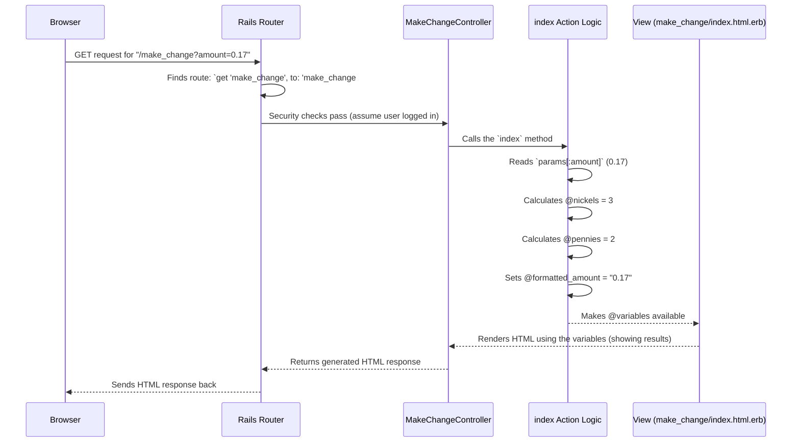

# Chapter 6: Make Change Feature Logic

Welcome back! In the previous chapter, [Base Application Controller](05_base_application_controller_.md), we saw how `ApplicationController` provides a common foundation and shared rules (like security checks) for other controllers in our app. We understand how controllers like `MakeChangeController` inherit these features.

Now, let's zoom in on `MakeChangeController` itself. We know it handles requests for the `/make_change` page, but what exactly does it *do*?

**The Problem:** Our application has a specific feature: calculating the minimum number of nickels and pennies needed to make a certain amount of change. How does the application perform this calculation when a user requests it? Where does this specific "coin counting" logic live?

**The Solution: Logic Inside the `MakeChangeController`'s `index` Action**

The specialized logic for the "Make Change" feature resides directly within the `index` action of the `MakeChangeController` (found in `app/controllers/make_change_controller.rb`). Think of this controller action as a dedicated mini-program or a specialized calculator built just for this one task: turning a dollar amount into nickels and pennies.

It needs to do three main things:

1.  **Get the Input:** Receive the dollar amount entered by the user.
2.  **Calculate:** Figure out the fewest nickels and pennies required.
3.  **Prepare Results:** Make the calculated numbers available so they can be shown back to the user on the web page.

**Using the Feature: A User's Journey**

Let's imagine you want to find the change for $0.17 (seventeen cents):

1.  **Visit the Page:** You navigate your browser to `http://localhost:3000/make_change`.
2.  **Enter Amount:** You see a form, type `0.17` into an input field labeled "Amount", and click "Submit".
3.  **Request Sent:** Your browser sends a request back to the same `/make_change` URL, but this time it includes the data you entered (`amount=0.17`).
4.  **Routing:** The [Request Routing](01_request_routing_.md) system directs this request to the `index` action of the `MakeChangeController` ([Chapter 2: Controller Actions](02_controller_actions_.md)).
5.  **Security Check:** Before the `index` action runs, the `authenticate_user!` check from the [Base Application Controller](05_base_application_controller_.md) ensures you are logged in ([Chapter 3: Authentication Enforcement](03_authentication_enforcement_.md)).
6.  **Calculation:** The `index` action runs. It sees the `0.17` you submitted, calculates that this is 3 nickels and 2 pennies.
7.  **Display Results:** The action prepares these results, and Rails renders the `make_change` web page again. This time, the page displays the results: "For $0.17, you need 3 nickels and 2 pennies."

**Inside the Calculator: The `index` Action Code**

Let's look at the code that performs the calculation:

```ruby
# File: app/controllers/make_change_controller.rb

# Inherits from ApplicationController (gets security checks, etc.)
class MakeChangeController < ApplicationController

  # This action handles GET requests to /make_change
  # Both for showing the initial form AND processing the submitted amount.
  def index
    # --- Step 1: Get the Input (if any) ---

    # 'params' holds data from the request (like form inputs).
    # 'defined? params[:amount]' checks if an 'amount' was submitted.
    if defined? params[:amount]

      # Get the submitted amount (comes as text) and convert
      # it to a precise Decimal number for accurate math.
      amount = params[:amount].to_d

      # --- Step 3: Prepare Results for Display ---
      # Variables starting with '@' are instance variables.
      # They become available in the HTML view file.

      # Format the amount nicely with two decimal places (e.g., 0.17 -> "0.17")
      @formatted_amount = sprintf("%0.2f", amount)

      # --- Step 2: Calculate ---

      # Nickels: Divide total by 0.05 and take the whole number part.
      # Example: 0.17 / 0.05 = 3.4. '.to_i' gives 3.
      @nickels = (amount / 0.05).to_i

      # Pennies:
      # 1. Calculate remaining amount after nickels: 0.17 - (0.05 * 3) = 0.02
      # 2. Divide remainder by 0.01: 0.02 / 0.01 = 2.0
      # 3. Round to handle tiny decimal errors: .round gives 2
      @pennies = ((amount - 0.05*@nickels) / 0.01).round
    end

    # If no amount was submitted (initial page load), the 'if' block
    # is skipped, and no calculations happen.

    # Rails automatically renders the corresponding view:
    # app/views/make_change/index.html.erb
    # This view can now use @formatted_amount, @nickels, @pennies if they exist.
  end
end
```

**Breaking Down the Code:**

*   **`if defined? params[:amount]`**: When you first load the page, no amount is submitted, so `params[:amount]` doesn't exist. This `if` condition is false, and the code inside is skipped. When you submit the form with `0.17`, `params[:amount]` *does* exist (its value is `"0.17"`), so the code inside runs. `params` is a special object Rails provides to access request data.
*   **`amount = params[:amount].to_d`**: The amount from the form comes in as text (`"0.17"`). We need to convert it to a number for math. Using `.to_d` converts it to a `Decimal` type, which is important for money calculations to avoid small errors that can happen with regular floating-point numbers.
*   **`@formatted_amount = sprintf("%0.2f", amount)`**: We store the original amount in an **instance variable** (`@formatted_amount`) so the view can display it nicely formatted (e.g., ensuring `0.1` shows as `0.10`). Variables starting with `@` in a controller action are automatically passed to the corresponding view file.
*   **`@nickels = (amount / 0.05).to_i`**: This is the core nickel calculation. We divide the total amount by the value of a nickel (0.05). `0.17 / 0.05` gives `3.4`. Since we can only have whole nickels, we use `.to_i` (to integer) to chop off the decimal part, leaving just `3`. We store this in the instance variable `@nickels`.
*   **`@pennies = ((amount - 0.05*@nickels) / 0.01).round`**: This calculates the pennies.
    *   `0.05 * @nickels`: Calculate the value of the nickels we found (0.05 * 3 = 0.15).
    *   `amount - ...`: Subtract the value of the nickels from the total amount (0.17 - 0.15 = 0.02). This is the remainder.
    *   `... / 0.01`: Divide the remainder by the value of a penny (0.01) to see how many pennies it makes (0.02 / 0.01 = 2.0).
    *   `.round`: We use `.round` just in case there are tiny inaccuracies in the decimal math; it ensures we get a whole number of pennies (2). This result is stored in `@pennies`.
*   **Implicit Rendering:** At the end of the action, because we didn't explicitly tell Rails to render or redirect elsewhere, it automatically looks for a view file matching the controller and action name: `app/views/make_change/index.html.erb`. It renders this file, making `@formatted_amount`, `@nickels`, and `@pennies` available for use within that HTML template to show the results to the user.

**How It Fits Together: The Request Flow**

Here's a simplified diagram showing the flow when you submit the amount `0.17`:



In this application, the calculation logic is simple enough to live directly inside the controller action. For more complex business rules, developers often move the logic into separate files (sometimes called Models or Service Objects) to keep the controller focused on coordinating the request and response.

**Conclusion**

You've just explored the specific logic behind the "Make Change" feature!

*   The `index` action within `MakeChangeController` contains the code dedicated to this feature.
*   It receives user input via the `params` object.
*   It performs mathematical calculations (`.to_d`, `/`, `.to_i`, `-`, `.round`) to determine the optimal number of nickels and pennies.
*   It uses instance variables (`@nickels`, `@pennies`, `@formatted_amount`) to pass the results to the view for display.
*   This demonstrates how a controller action orchestrates getting input, processing it according to specific business rules, and preparing the output.

We've now seen how requests are routed, how controllers handle them, how security is enforced, how login works, how controllers share code, and how specific feature logic is implemented. What's left? We need to understand how the application itself is configured – things like settings for different environments (development vs. production) and how we manage sensitive information.

Let's wrap up by looking at [Application Configuration](07_application_configuration_.md)!

---

Generated by [AI Codebase Knowledge Builder](https://github.com/The-Pocket/Tutorial-Codebase-Knowledge)