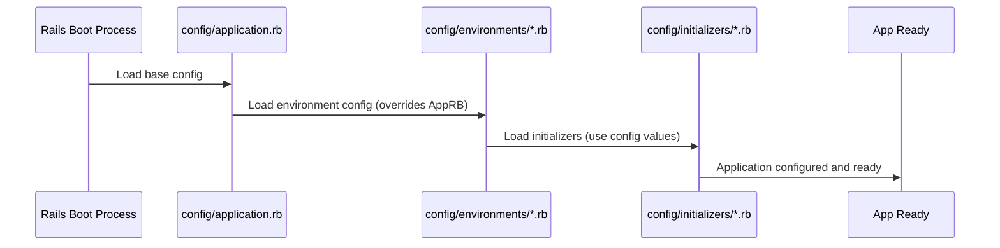

# Chapter 7: Application Configuration

In [Chapter 6: Make Change Feature Logic](06_make_change_feature_logic_.md), we saw the specific code that calculates nickels and pennies. We've explored routing, controllers, authentication, and specific features. But how does the application manage its overall settings? For example, how does it know the address of the FusionAuth server we used in [Chapter 4: OmniAuth OIDC Integration (FusionAuth)](04_omniauth_oidc_integration__fusionauth__.md)? How does it behave differently when we are developing it versus when it's running live for users?

**The Problem:** Our application needs a way to manage various settings – like connection details for external services (FusionAuth), operational modes (development vs. production), and basic framework behaviors. Hardcoding these everywhere would be messy and difficult to change.

**The Solution: Centralized Application Configuration**

Think of **Application Configuration** as the central control panel or settings menu for our entire `complete-app`. It's where we define how different parts should behave, connect to external services (like FusionAuth), and operate under various conditions (like development vs. production).

This control panel isn't a single screen, but rather a collection of special files, mostly located in the `config/` directory of our project. These files manage:

1.  **Framework Defaults:** Basic settings for the Rails framework itself.
2.  **Environment Settings:** Different settings for different situations, like `development` (when we're building the app), `test` (when we're running automated tests), and `production` (when real users are accessing it).
3.  **Custom Settings:** Specific details needed for our application, like the FusionAuth client ID and issuer URL.
4.  **Initializers:** Code that runs when the application starts up, often used to set up connections or configurations *using* the settings defined elsewhere.

**The `config/` Directory: The Settings Hub**

Most of the configuration magic happens in files within the `config/` folder:

```
complete-app/
├── app/
├── config/
│   ├── application.rb        # Base settings for the whole app
│   ├── boot.rb               # Helps boot the app quickly
│   ├── environment.rb        # Loads the application
│   ├── environments/         # Environment-specific settings
│   │   ├── development.rb    # Settings ONLY for development
│   │   ├── production.rb     # Settings ONLY for production
│   │   └── test.rb           # Settings ONLY for testing
│   ├── initializers/         # Setup code run on startup
│   │   └── omniauth.rb       # Our OmniAuth/OIDC setup
│   ├── routes.rb             # Request routing (from Chapter 1)
│   └── # ... other config files ...
├── db/
├── lib/
└── # ... other project folders ...
```

Let's look at the key players.

**`config/application.rb`: The Foundation**

This file contains settings that generally apply to the application regardless of the environment. It's like the factory default settings for an appliance.

```ruby
# File: config/application.rb (simplified)
require_relative "boot"
require "rails/all"

Bundler.require(*Rails.groups)

module Myapp # Our application's name
  class Application < Rails::Application
    # Load default settings for our Rails version
    config.load_defaults 7.0

    # --- Other settings might go here ---
    # Example: Setting a default time zone
    # config.time_zone = "Eastern Time (US & Canada)"

    # Custom settings namespace (we'll see this later)
    # config.x.some_custom_setting = "value"
  end
end
```

*   This file sets up the basic Rails framework components (`require "rails/all"`).
*   It defines our application module (`module Myapp`).
*   `config.load_defaults` loads sensible defaults based on the Rails version.
*   We *could* put other application-wide settings here using `config.setting_name = value`.

**`config/environments/`: Adapting to the Situation**

Often, we need the app to behave differently when we're developing versus when it's live.

*   **Development (`development.rb`):** We want helpful error messages, and we want the app to automatically reload code when we change files so we don't have to restart the server constantly. Performance isn't the top priority.
*   **Production (`production.rb`):** We want maximum speed and efficiency. Detailed error messages should be hidden from users, and code should be loaded once at the start for better performance.

Files in `config/environments/` override or add to the settings from `config/application.rb`.

Let's compare one setting:

```ruby
# File: config/environments/development.rb (snippet)
Rails.application.configure do
  # In development, don't cache code. Reload it on each request.
  # This makes development easier as changes show up immediately.
  config.cache_classes = false

  # Show detailed error pages if something goes wrong.
  config.consider_all_requests_local = true

  # ... other development settings ...
end
```

```ruby
# File: config/environments/production.rb (snippet)
Rails.application.configure do
  # In production, load code once and cache it for speed.
  config.cache_classes = true

  # Don't show detailed error pages to the public user.
  config.consider_all_requests_local = false

  # ... other production settings ...
end
```

You can see how `config.cache_classes` is set differently depending on the environment. Rails automatically loads the correct file based on how the server is started (usually `development` by default locally, and `production` on a live server).

**Custom Settings: Our FusionAuth Details**

Remember in [Chapter 4: OmniAuth OIDC Integration (FusionAuth)](04_omniauth_oidc_integration__fusionauth__.md) how we needed our app's Client ID and the FusionAuth Issuer URL? Where did we store those? We put them in the environment configuration using a special `config.x` namespace.

```ruby
# File: config/environments/development.rb (snippet)
Rails.application.configure do
  # ... other development settings ...

  # --- Our Custom FusionAuth Settings for Development ---
  # 'config.x' is a place for custom application settings.
  config.x.fusionauth.issuer = "http://localhost:9011"
  config.x.fusionauth.client_id = "e9fdb985-9173-4e01-9d73-ac2d60d1dc8e"

  # In production.rb, these would point to the live FusionAuth server
  # and potentially a different client_id.
end
```

*   **`config.x.fusionauth...`**: Rails gives us `config.x` as a space to define our own, custom configuration settings. Here, we've created a `fusionauth` subsection to hold the `issuer` and `client_id`. This keeps our custom settings organized.

**`config/initializers/`: Putting Settings to Use**

Now that we've *defined* our settings (like the FusionAuth details), how do we *use* them? Files in the `config/initializers/` directory are run when the application starts up, *after* the main `application.rb` and environment (`development.rb`, etc.) files have been loaded. This makes it the perfect place to set up services that depend on those configuration values.

Look at our OmniAuth setup file again:

```ruby
# File: config/initializers/omniauth.rb (snippet)

Rails.application.config.middleware.use OmniAuth::Builder do
  provider :openid_connect,
    name: :fusionauth,
    scope: [:openid, :email, :profile],
    response_type: :code,

    # --- Using our custom settings ---
    issuer: Rails.configuration.x.fusionauth.issuer, # Read from config.x

    client_options: {
      identifier: Rails.configuration.x.fusionauth.client_id, # Read from config.x
      secret: ENV["OP_SECRET_KEY"], # Read from environment variable
      redirect_uri: 'http://localhost:3000/auth/fusionauth/callback',
      # ... other endpoints often derived from issuer ...
      authorization_endpoint: Rails.configuration.x.fusionauth.issuer+"/oauth2/authorize",
      token_endpoint: Rails.configuration.x.fusionauth.issuer+"/oauth2/token",
      userinfo_endpoint: Rails.configuration.x.fusionauth.issuer+"/oauth2/userinfo",
    }
end
```

*   **`Rails.configuration.x.fusionauth.issuer`**: Inside an initializer (or anywhere else in the app after startup), we can access our custom settings using `Rails.configuration.x.setting_name`.
*   **`ENV["OP_SECRET_KEY"]`**: Notice the `secret` is *not* read from `config.x`. Secrets like API keys and passwords should **never** be stored directly in your code or configuration files (especially if using version control like Git). A common practice is to use **Environment Variables** (`ENV[...]`). These are set outside the application code, making them more secure. How they are set depends on your deployment environment.

**How it Works: Configuration Layering**

Rails loads configuration in a specific order, like applying layers of paint:

1.  **Base Coat (`config/application.rb`):** Loads framework defaults and application-wide settings.
2.  **Specific Color (`config/environments/*.rb`):** Loads settings for the *current* environment (e.g., `development.rb`), potentially overriding settings from `application.rb`.
3.  **Finishing Touches (`config/initializers/*.rb`):** Runs code that often uses the settings defined in the previous layers to configure services like OmniAuth.



This layering allows for flexible and organized configuration management.

**Conclusion**

You've now learned about Application Configuration! It's the system that manages all the settings and startup procedures for our Rails application.

*   Configuration files primarily live in the `config/` directory.
*   `config/application.rb` sets the base configuration.
*   `config/environments/` files (`development.rb`, `production.rb`) tailor settings for specific environments, overriding base settings where needed.
*   We can define custom settings using `config.x` (like `config.x.fusionauth`).
*   `config/initializers/` run at startup and use the configured settings to set up services (like OmniAuth).
*   Sensitive data like secrets should use Environment Variables (`ENV["..."]`) instead of being hardcoded.
*   Configuration is loaded in layers, allowing environment-specific settings to take precedence.

Understanding configuration is crucial for managing how your application behaves in different scenarios and how it connects to external services securely.

This concludes our journey through the `complete-app` tutorial! We've gone from understanding how a web request finds its way through [Request Routing](01_request_routing_.md), to how [Controller Actions](02_controller_actions_.md) handle those requests, how we enforce security with [Authentication Enforcement](03_authentication_enforcement_.md) and [OmniAuth OIDC Integration (FusionAuth)](04_omniauth_oidc_integration__fusionauth__.md), how controllers share common logic via the [Base Application Controller](05_base_application_controller_.md), how specific [Make Change Feature Logic](06_make_change_feature_logic_.md) is implemented, and finally, how the entire application is configured using [Application Configuration](07_application_configuration_.md).

We hope this step-by-step guide has given you a solid foundation for understanding how a complete web application like this one works. Happy coding!

---

Generated by [AI Codebase Knowledge Builder](https://github.com/The-Pocket/Tutorial-Codebase-Knowledge)