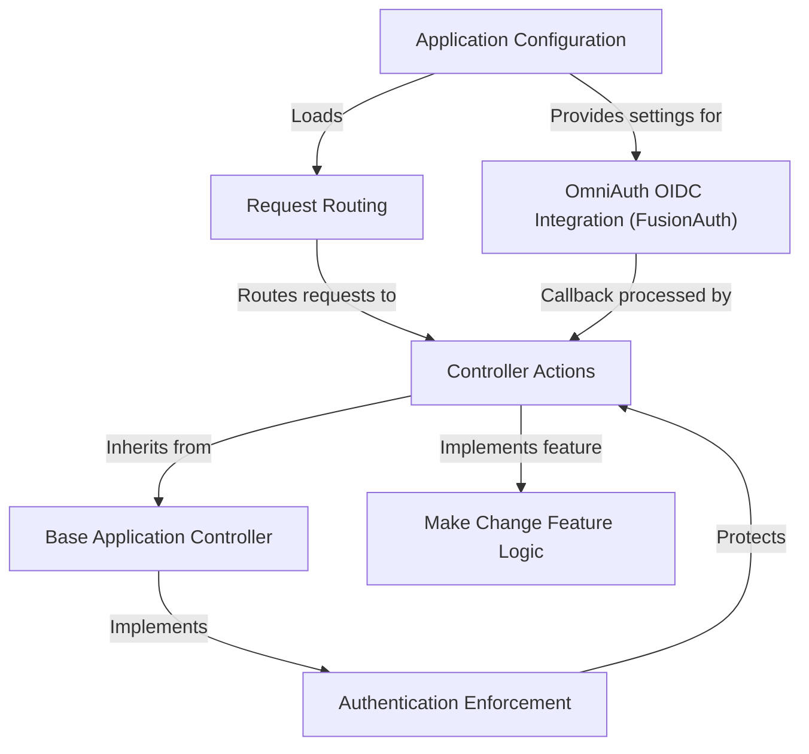

# Tutorial: complete-app

This is a simple web application built with Ruby on Rails.
Its main purpose is to demonstrate user **authentication** using an external service (*FusionAuth* via OpenID Connect).
Unauthenticated users see a home page, while logged-in users can access a feature like the *make change* calculator, which determines the minimum nickels and pennies for a given amount.
The application uses standard Rails components like **Request Routing** to map URLs to **Controller Actions**, and an **Application Configuration** system manages settings like the FusionAuth connection details.

**Source Repository:** [None](None)

## Chapters

1. [Request Routing
](01_request_routing_.md)
2. [Controller Actions
](02_controller_actions_.md)
3. [Authentication Enforcement
](03_authentication_enforcement_.md)
4. [OmniAuth OIDC Integration (FusionAuth)
](04_omniauth_oidc_integration__fusionauth__.md)
5. [Base Application Controller
](05_base_application_controller_.md)
6. [Make Change Feature Logic
](06_make_change_feature_logic_.md)
7. [Application Configuration
](07_application_configuration_.md)

---

Generated by [AI Codebase Knowledge Builder](https://github.com/The-Pocket/Tutorial-Codebase-Knowledge)